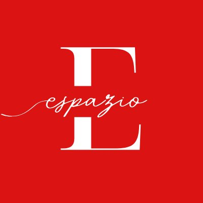

# Espazio — Arts + Food + History

> A mockup website for **Espazio Tacloban** — a curated space celebrating the art, flavors, and heritage of Eastern Visayas in Tacloban City, Leyte, Philippines.



## 🌐 Live Preview

Open `index.html` in any modern browser — no build step required.

## 📁 Project Structure

```
espazio-website/
├── index.html              # Main entry point
├── css/
│   └── styles.css          # All styles (variables, layout, responsive)
├── js/
│   └── main.js             # Navigation, menu tabs, scroll reveal
├── assets/
│   └── images/
│       └── logo.png        # Espazio logo
├── .gitignore
├── LICENSE
└── README.md
```

## ✨ Features

- **Responsive Design** — Mobile-first layout with hamburger nav
- **Full Menu** — 6 tabbed categories with all items & prices (₱)
  - Hot Drinks (Coffee & Non-Coffee)
  - Iced Drinks
  - Frappes & Smoothies
  - Juices & Soda
  - Pasta (with descriptions)
  - Snacks (Burgers, Sandwiches, Soups, Salads, Sides)
- **Operating Hours** — Mon–Sat 11:30 AM – 10:30 PM, auto-highlights today
- **Scroll Animations** — Intersection Observer-based reveal effects
- **Sticky Navbar** — Transparent → dark on scroll
- **Editorial Aesthetic** — Cormorant Garamond + Josefin Sans + Lora typography
- **No Dependencies** — Pure HTML, CSS, and vanilla JS

## 🎨 Design System

| Token        | Value      | Usage                   |
|-------------|-----------|-------------------------|
| `--red`     | `#C41E1E` | Primary / brand         |
| `--deep-red`| `#9A1515` | Dark accent             |
| `--cream`   | `#FAF6F0` | Background              |
| `--warm`    | `#F5EDE3` | Section backgrounds     |
| `--dark`    | `#1A1311` | Dark sections / footer  |
| `--gold`    | `#C4A265` | Accent / highlights     |
| `--muted`   | `#8A7E74` | Secondary text          |
| `--coffee`  | `#6B4226` | Coffee-themed accents   |

**Fonts:** Cormorant Garamond (headings) · Josefin Sans (labels/nav) · Lora (body)

## 🚀 Getting Started

```bash
# Clone the repo
git clone https://github.com/your-username/espazio-website.git
cd espazio-website

# Open in browser
open index.html
# or use a local server
npx serve .
```

## 📝 Customization

- **Add real images:** Replace placeholder `<div>`s in the HTML with `` tags pointing to your photos in `assets/images/`
- **Update menu:** Edit the menu panels directly in `index.html`
- **Change colors:** Modify CSS variables in `:root` inside `css/styles.css`
- **Add pages:** Create new files in a `pages/` directory and link from nav

## 📱 Social

- Facebook: [facebook.com/espazio.tacloban](https://www.facebook.com/espazio.tacloban)

## 📄 License

This project is for mockup/demo purposes for Espazio Tacloban.
# espazio-website
